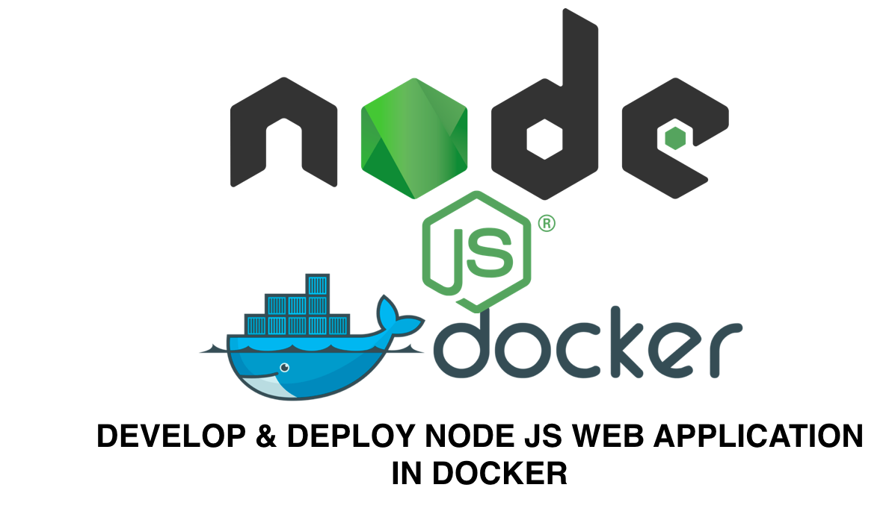
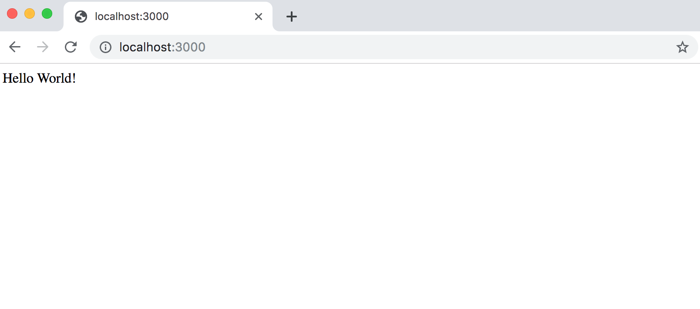
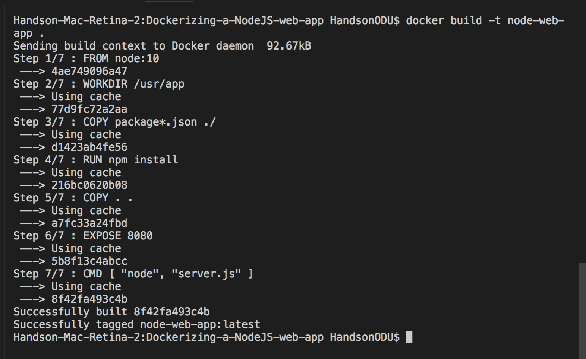
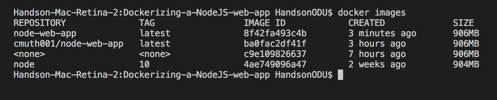
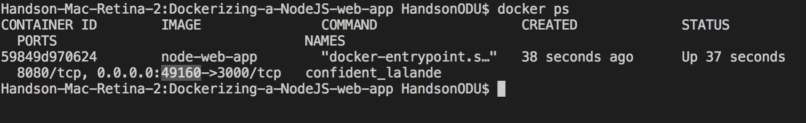
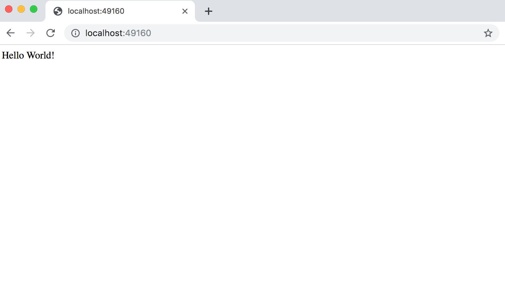

# Dockerizing-a-NodeJS-web-app
<p align="center">
    
</p>
<hr>

Create a simple nodeJs application and deploy it onto a docker container.

1. Create a working directory
    > mkdir <working_directory_name>
  
2. Running this command in working directory will initialize your project
    > npm init
  
This will create a **package.json** file in the folder, that file contains app dependency packages.

Replace the following code of package.json

```js
  // package.json

  {
    "name": "docker_web_app",
    "version": "1.0.0",
    "description": "Node.js deploy on Docker container",
    "author": "cmuth001@odu.edu",
    "main": "server.js",
    "scripts": {
      "start": "node server.js"
    },
    "dependencies": {
      "express": "^4.16.1"
    }
  }
```

2. Running this command will install all the dependencies from package.json 
    > npm install
3. Lets create a **server.js** file that defines a web-app using an Express framework.

  
 ```js
    // server.js
    'use strict';
    var express = require('express');
    var app = express();
    app.get('/', function (req, res) {
      res.send('Hello World!');
    });
    app.listen(3000, function () {
      console.log('Example app listening on port 3000!');
    });

 ```
 
4. Lets test the application, run the below command
    > node server.js
  
  If you followed the  above steps on your system, you will see the same output as below image: [http://localhost:3000/](http://localhost:3000/)
  
  <p align="center">
    
  </p>
      
  Now node.js app is running successfully.
   
Lets try running the same node.js application running on the docker container. To run the application on the docker conatiner we need a docker image. 

First, we will create a docker image for the application.
   
5. Create a **Dockerfile**
    > touch Dockerfile
6. Dockerfile should look like this
```
FROM node:10
# Create app directory
WORKDIR /usr/app

# Install app dependencies
# A wildcard is used to ensure both package.json AND package-lock.json are copied
# where available (npm@5+)
COPY package*.json ./

RUN npm install
# If you are building your code for production
# RUN npm ci --only=production

# Bundle app source
COPY . .
EXPOSE 3000
CMD [ "node", "server.js" ]

```
7. Create **.dockerignore** file with following content
 
```
node_modules
npm-debug.log
```
   This will prevent from copying onto docker image.
    
8. Building Docker image
    > docker build -t node-web-app .
    
    <p align="center">
        
      </p>
9. Check the Docker images
    > docker images
    
    <p align="center">
        
      </p>
10. Run the docker image
    > docker run -p 49160:3000 -d node-web-app
 
11. Get the container id
    > docker ps
    
    <p align="center">
        
      </p>
      
12. Lets know where it is running on
    > docker logs <container_id>
    
```
output: 
    Example app listening on port 3000!
```
13. If you followed the  above steps on your system, you will see the sam output as below image: [http://localhost:49160/](http://localhost:49160/)
  
  <p align="center">
        
      </p>
    
I hope this tutorial helped you get up and running a simple Node.js application on Docker container.
    
 
